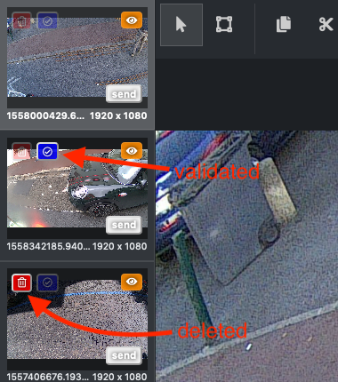
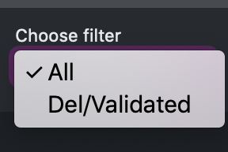
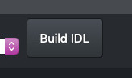

## As an admin

_____

### <u>New buttons</u>

**The red and blue badges on the picture**

The red one with a trash on it tells if the image has been deleted.
If it is transparent, it means that the image is not deleted.
If it is opaque, the image has been deleted.
If you click on the badge, you can switch between deleted and undeleted.
You **do not** need to press the « send » button when you change the « deleted » status of an image.

The blue one with a tick symbol indicates if the image is validated.
« Validated » means that several taggers agreed on the current regions that you can see on the image.
If it is transparent, it means that the image is not validated.
If it is opaque, the image has been validated.
If you click on the badge, you can switch between validated and unvalidated.
You **do not** need to press the « send » button when you change the « validated » status of an image.

**The « Choose filter » selection**

You can select between « All » and « Del/validated ». If you choose « All », you will have all kind of images. If you choose « Del/validated », you will only have the images that have been deleted or validated.

**The « Build IDL » button**

This button **definitively** validates your work. If you click on it, it will remove all the validated and delete pictures from your session, and this images will be considered as reviewed by an admin. You need to be careful with this button because once you press it, you can’t go back. So make sure that your images are correctly reviewed.

### <u>Your role as an admin</u>

As an admin, your role is to check if the tagging of the images is correct. In the end, all the images of your current session have to be either validated or deleted.

**Steps**

1. Select a number of images to tag (if you want more or less than 20) and refresh session

2. For each image, check the badges to see if it has been validated or deleted, and change it if necessary.
   **You should delete**

 - Images with readable license plates
 - Images of private properties
 - Images with recognizable faces
 - Images with automatic annotation (regions that you cannot click on)
 - Images that have too much of a same litter and that you cannot tag properly. For example, if there are too many leaves, you need to delete it (and **not** just tag it partially)

​	**You should validate:**

- Images that were correctly tagged
- Images without any litter

​	**You should un-delete**:

- Images that were deleted for no reason

3. For each image that is **not deleted**, fix regions if necessary. You can add tags, deleted tags, change the size of the regions and change the tags. Check that all the regions have the correct tags and make sure that all the litters on the image were tagged. Make sure that each regions is exactly the size of the litter it covers.
   If you make any change to a region, don’t forget to **press the « send » button**. The image will remain in your session.
   As you are now an admin, whenever you press the « Send » button, the image is automatically validated.

4. When you have carefully checked all the images of your session, press the « Build IDL » button to confirm that the images have been reviewed. The session will be refreshed and a green « success » pop-up will be displayed.

### <u>Reminder</u>

Please check this page for the complete list of the rules concerning the images: https://github.com/Cortexia-CH/image-tagging-doc/blob/master/index.md.

Here are a reminder of a few important rules:

- You need to tag **all** the litters of an image. If you cannot, you need to delete it. Never tag an image partially.
- You need to tag one litter per region. Never group several litters in one single region (expect for the « group of leaves » litter type
