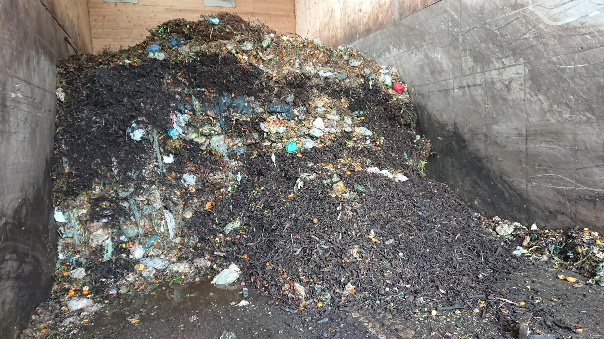

# Cortexia tagging tool for biowaste

This page describes the use of the Cortexia tagging tool for biowaste. 
The general information about tagging is [here](./index.md)
The specific information for city cleanliness [here](./tagging-tool.md)

## Table of Contents

- Context biowaste
- List of labels
- Label desciption
- Examples

## Context biowaste

This VoTT tagging space has been set up to create a data base of annotated images in view of detecting impurities in biowaste. Like for object detection, the tag format is a rectangle (bounding box) with an attributed class.

Biowaste is a resource which is collected and transformed into energy and fertilizer for the agriculture. At collection, biowaste contains all sorts of compostable items as well as non-desired object. The size of the objects varies from a few millimeters to tens of centimeters. A high density of objects is visible on the images from which only a fraction needs to be tagged: The unwanted ones.

The images to be tagged come from 3 possible contexts described as follows, where 1) the labels and 2) the content of interest are the same: impurities (1) in biowaste (2).

1) A truck from road services collects the biowaste at individuals’ collection points. The biowaste is stored in the individual’s containers waiting along the street to be loaded inside the truck chamber. The image acquisition is made from the inside of the truck chamber when the content from a container is poured inside and falls and spreads in the chamber's bed. On these images, the inside structured of the truck chamber are visible like the piston and the hydraulic press. The zone of interest for tagging is the surface of the chamber’s bed covered by the biowaste.

 

2) The images are taken at the end of the collection tour when the entire truck’s load is delivered at the biowaste treatment center. Images show the back side of the truck, while the content is slowly poured outside. The zone of interest for tagging is delimited by the frame of the truck’s main back door. 

 

3) Individuals bring the biowaste at a collection center. Images of the accumulated biowaste are taken from a fix position. The zone of interest for tagging is the surface on the image covered with biowaste.

## List of labels
Label list by categories containing types:

[-1]all-authorised
      vegetables
      choped-wood
      grass
      etc...
[0] metal
      can
      alumnium-foil
      etc...
[1] innert-plastic
      bags
      packing
      etc...
[2] innert-mineral
      glass
      porcelan
      stone
      concrete
[3] land-fill
      sand
      gravel
      soil
      etc...
[4] composites
      tetrapack
      pampers
      plywood
      treated-wood
      etc...
[5] combust
      ashes
      coal
[6] wood
      branches
      trunk
      manufactured-untreated
[7] paper-based
      paper
      cardboard
      etc...
[8] compostable bags
[9] cooking
      meat
      bones
      cheese
      eggs
      bread
      paste
      coffee
      etc...
[10]animals
      litter
      carcass
      etc...
[11]residual-impurities

Remarks: 
What cannot be labeled: Oils, invasive plants, covered imourities etc...
What is difficult to label: Distinguish plastic from compostable bags.

## label description

[-1] all-authorised:
The majority of objects visible in the zone of interest on the images and which are accepted by common regulations. This cathegory should not be tagged.
Examples of this are vegetables, fruits, small branches, choped wood, grass, etc...

[0] metal
All object that are obviously made or part of an object made of metal
Examples of this are can, screw, aluminium foils, hammer head, tools, etc....

Inert waste is waste which is neither chemically nor biologically reactive and will not decompose or only very slowly. 
Examples of this are sand, concrete, glass, porcelan, plastic

[1] innert-plastic
Synthetic materials that use polymers as a main ingredient. 
Examples of this are platic bags, platic bottels, packing material, toys, etc....

[2] inert-mineral
Hasardous material like glass or porcelan whose fragments are sharp as well as big stones or concrete that might damage the waste treatment facility. All mineral object big enought to be undesired in cultiavted fields. Some small size minerals like sand or gravel are classified in landfilled

[3] land-filled 
etc... to be finished after list is validated

