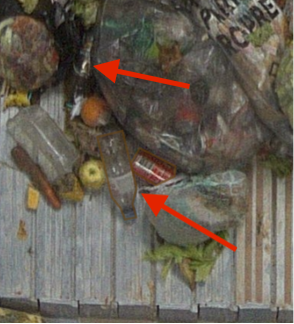

# Biowaste

For this projects, you will tag anomalies in images of compost.

### :page_facing_up: Biowaste instructions:

1. Observe carefully the image to find any object of the categories. There are a lot of things in those images so take your time to find any anomaly in the image.

2. You'll see a lot of plastic food pacckaging. Those are not considered as anomalies.

3. When a whole object is split in two because there's another object in front of it masking part of it, please draw both parts separately and then use the "same object" relation to indicate that both parts go together.

4. Please do not skip any of the imagee.

### Categories descriptions
Please read very carefully and entirely!
The tags on those images are means to help you recognize the categories. Please do not take the shaping as example, it was really roughly done and we expect a finer work.

##### 1 – Glass bottle :
Glass bottle of any colour.

##### 2 - Opaque plastic bag:

Opaque platic bag of any colour.
Transparent plastic bags **should not be tagged**.

##### 3 - Big carboard:

Only carboards of a significant size, for example used to wrap packs of food, big toys etc...

##### 4 - PET bottle:
:warning: This is a subcategory of "Empty packaging"

All PET bottles.

##### 5 - Can:
:warning: This is a subcategory of "Empty packaging"

All cans.

##### 6 - Polystyrene (SAGEX, ...)
:warning: This is a subcategory of "Other wastes"
Any polystyrene object (for example SAGEX packagings). Polystyrene is aways white and the material is usually quite distinctive.

##### 7 - Cleaning/maintainance products:
:warning: This is a subcategory of "Dangerous products"

Plastic bottles that contain dangerous products such as detergent, cleaning products, etc...
Please include spray cans (for example hair spray).

##### 8 - Hygiene products:
:warning: This is a subcategory of "Dangerous products"

Any kind of hygiene products, for example body wash bottles, shampoo bottles, toothpaste tube...

