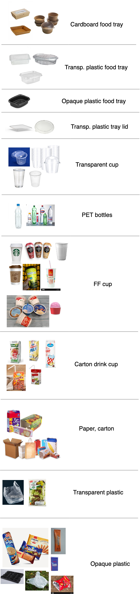
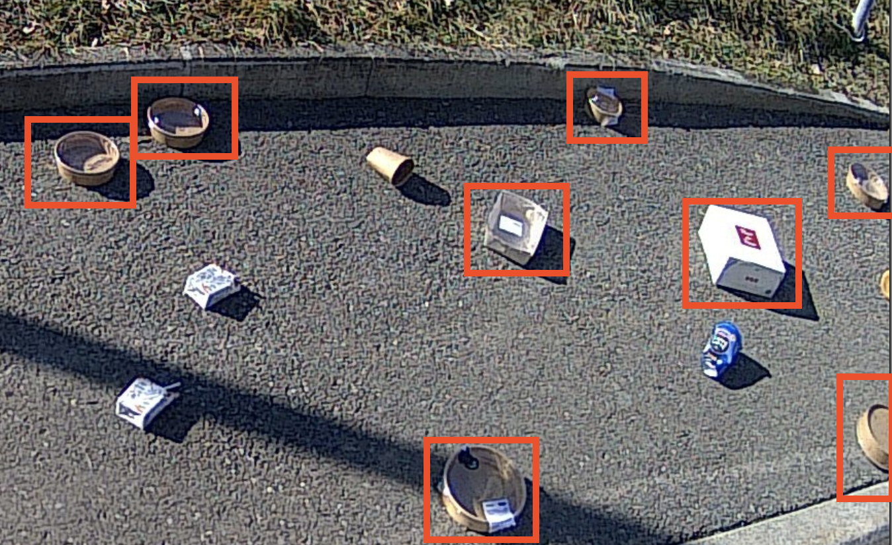

# Special categories and examples

# Table of Contents
- [Deal with cups](#waste0)
- [carton drink receptacles (#7)](#waste7)
- [FF cups drink receptacles (#8)](#waste8)
- [FF foam polystyrene (#9)](#waste9)
- [Food packaging (#10)](#waste10)
- [glass splinter (#13)](#waste13)
- [Syringes (#14)](#waste14)
- [FF cups (only cup) (#21)](#waste21)
- [FF cups (only lid) (#22)](#waste22)
- [FF cups (only straw) (#23)](#waste23)
- [FF fries box (#24)](#waste24)
- [Unclear bottles (#25)](#waste25)
- [FF burger/nuggets boxe (#26)](#waste26)
- [FF paper folder (#27)](#waste27)
- [FF other box (happymeal...) (#28)](#waste28)
- [iqos (#29)](#waste29)
- [Confettis (#30)](#waste30)
- [Medium big stain (#31)](#waste31)
- [Transparent plastic (#32)](#waste32)
- [Opaque plastic (#33)](#waste33)
- [Fabric (#34)](#waste34)
- [Bottle/can capsules (#35)](#waste35)
- [carcass (#36)](#waste36)
- [Robydogs (#42)](#waste42)
- [other foam polystyrene (#43)](#waste43)
- [masks (#45)](#waste45)
- [Nitrous oxyde bottle (#46)](#waste46)
- [Transp. plastic food tray (#48)](#waste48)
- [Opaque plastic food tray (#49)](#waste49)
- [Cardboard food tray (#50)](#waste50)
- [Transp. plastic tray lid (#51](#waste51)
- [Transparent cup (#52)](#waste52)

## All categories with images

### Quick view - confusing categories
This table shows several examples for categories that mgith be mistaken with others. This is not an exhaustive list.
You will find each category with description and other examples below.

### carton drink receptacles (#7) 

They are rectangular carton drink cups (small carton drink boxes with a little straw), or carton (for example carton of milk) or juice.

### FF cups drink receptacles (#8) 

Plastic or cardboard fast food cups, for example Mc Donald's or Starbucks cups, ice cream cups and any other cardboard or opaque plastic cup. Basically the only cups that should not go in FF cups are the transparent ones.

### FF foam polystyrene (#9) 

Fast food boxes that are made of polystyrene

/!\ We only want the **fast food** boxes in this category. For other polystyrene litters, please see **#43**.

 ### Food packaging (#10) 
PLEASE DO NOT USE ANYMORE

<!-- Every kind of food packaging

 --> 

### glass splinter (#13) 

Crushed glass or broken glass. Please **both** piles of glass and isolated pieces of glass as "glass splinter".

### Syringes (#14) 

### FF cups (only cup) (#21) 
PLEASE DO NOT USE ANYMORE - USE FF CUP DRINK RECEPTACLE INSTEAD

<!-- Fast food cup - there is only the receptacle.
Please use this label only if you see a ff cup that is usually composed

 -->

### FF cups (only lid) (#22) 

Fast food cup - there is only the lid.
Do not tag the lid if it's on the cup: in this case tag the whole this as FF cup. Tag it only if it's completely separate.

In this case, you should tag the lid and the straw using 2 bounding boxes. Here is how to tag the **lid part** (see the straw in the category below):

### FF cups (only straw) (#23) 

Fast food cup - there is only the straw. Do not tag the straw if it's on the cup: in this case tag the whole this as FF cup. Tag it only if it's completely separate.

In this case, you should tag the lid and the straw using 2 bounding boxes. Here is how to tag the **straw part** (see the lid in the category above):

### FF fries box (#24) 

Fast food fries boxes (for example Mc Donald's fries boxes)

### Unclear bottles (#25) 

Bottles that are too bright or to dark to be sure that it is PET or glass.

### FF burger/nuggets boxe (#26) 

Fast food burger of nuggets boxes

### FF paper folder (#27) 

Fast food paper folders for burgers

### FF other box (happymeal...) (#28) 

All the fast food boxes that do not correspond to the other categories, for example Happymeals or take-away bags.

### iqos (#29) 

Iqos are special cigarettes that are heated by a device.

Description: iqos look like cigarettes, but completely **white**, a little bit **longer** than the cigarette butts (because they do not burn) and a bit **thiner**.

(source: https://vaping360.com/wp-content/uploads/2016/12/IQOS-33.jpg)

#### How to recognize iqos?

Here are the questions you should ask yourself when tagging iqos on images:

Here are some examples on objects that should or should not be tagged as iqos:

### Confettis (#30) 

They are small colored pieces of papers used in parties. Please tag the whole pile.

### Medium big stain (#31) 

Medium or big stain of any colour.

:warning: Do not tag water stains!

### Transparent plastic (#32) 

All kind of transparent plastic: bags, glasses, boxes...
**There are separate categories for transparent cups (#52), transparent tray lids (#51) and transparent food trays (#48). Please do not tag them as transparent plastic.**

### Opaque plastic (#33) 

All kind of opaque plastics.

|

### Fabric (#34) 

Can be clothes or other kind of fabric. Please do not tag masks as fabric, as we have a specific category (#45)

### Bottle/can capsules (#35) 

|

### carcass (#36) 

Animal carcass

### Robydogs (#42) 

Robydogs are small plastic bags that contain dog droppings. They can be of several colours.

In the following images you can see those robydogs:

The robydog is only the plastic bag, not the bin! Here are some examples of robydogs on the ground:

### other foam polystyrene (#43) 

All the polystyrene litters that are not fast food (see #9)

|

### masks (#45) 

Face protection masks. Most of the time, you will see blue paper mask (circled in red)

### Nitrous oxyde bottle (#46) 

Small bottles of nitrous oxyde. They are made of metal, pretty small, with a recognizable shape. The end usually appears lighter because it reflects the light.

### Transparent plastic food tray (#48) 
Transparent tray that used to contain food.
Can be round or rectangular, has to be transparent. If the lis is on, or partially placed on it, please tag the whole object as plastic food tray (do **not** tag the lid separately).

### Opaque plastic tray lid (#49) 
Opaque plastic tray that used to contain food.
Can be round or rectangular, has to be opaque, will usually be black. If the lis is on, or partially placed on it, please tag the whole object as plastic food tray (do **not** tag the lid separately).

### Cardboard food tray (#50) 
Cardboard tray that used to contain food.
Can be round or rectangular, has to be made of cardboard. If the lis is on, or partially placed on it, please tag the whole object as plastic food tray (do **not** tag the lid separately).

The cardboard food trays look like the types in this image

### Transparent plastic tray lid (#51) 
Transparent plastic that goes on any kind of food trays (plastic or cardboard).
Usually you'll find them near a plastic food tray.
If it's fully or partially on the food tray (no matter which kind), do **not** tag the lid, only tag the whole object as food tray.

### Transparent cup (#52) 
Any kind of transparent cup, whether it's big small, made to contain liquid or food.
Please do not mistake them with circular food tray (which are widder and shorter).

##### Image sources
- https://france3-regions.francetvinfo.fr/image/vqxTVsRGp--4Zu6nPIcHZgR6Z1M/600x400/regions/2020/06/09/5edf950e2fee1_img_8118-4553541.jpg
- https://medias.cerveauetpsycho.fr/api/v1/images/view/5da9008b3e4546731a4ec5f0/wide_1300/image.jpg
