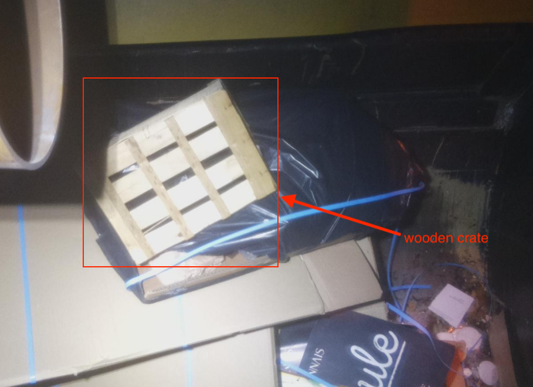

## Special categories and examples

### carton drink receptacles (#7)

They are carton drink cups (for example take-away coffee cups), or carton (for example carton of milk).

### FF cups drink receptacles (#8)

Plastic fast food cups (for example Mc Donald's cups). Please use this category only if you can see the whole cup (cup + lid + straw). If  not, please use other categories (#21, #22 or #23)

### FF foam polystyrene (#9)

Fast food boxes that are made of polystyrene

/!\ We only want the **fast food** boxes in this category. For other polystyrene litters, please see **#43**.

### Food packaging (#10)

Every kind of food packaging

### glass splinter (#13)

Crushed glass or broken glass

### FF cups (only cup) (#21)

Fast food cup - there is only the receptacle

### FF cups (only lid) (#22)

Fast food cup - there is only the lid.

In this case, you should tag the lid and the straw using 2 bounding boxes. Here is how to tag the **lid part** (see the straw in the category below):

### FF cups (only straw) (#23)

Fast food cup - there is only the straw.

In this case, you should tag the lid and the straw using 2 bounding boxes. Here is how to tag the **straw part** (see the lid in the category above):

### FF fries box (#24)

Fast food fries boxes (for example Mc Donald's fries boxes)

### Unclear bottles (#25)

Bottles that are too bright or to dark to be sure that it is PET or glass.

### FF burger/nuggets boxe (#26)

Fast food burger of nuggets boxes

### FF paper folder (#27)

Fast food paper folders for burgers

### FF other box (happymeal...) (#28)

All the fast food boxes that do not correspond to the other categories, for example Happymeals or take-away bags.

### iqos (#29)

Iqos are special cigarettes that are heated by a device.

Description: iqos look like cigarettes, but completely **white**, a little bit **longer** than the cigarette butts (because they do not burn) and a bit **thiner**.

(source: https://vaping360.com/wp-content/uploads/2016/12/IQOS-33.jpg)

#### How to recognize iqos?

Here are the questions you should ask yourself when tagging iqos on images:

Here are some examples on objects that should or should not be tagged as iqos:

### Confettis (#30)

They are small colored pieces of papers used in parties. Please tag the whole pile.

### Transparent plastic (#32)

All kind of transparent plastic: bags, glasses, boxes...

### Opaque plastic (#33)

All kind of opaque plastics.

|

### Fabric (#34)

Can be clothes or other kind of fabric. Please do not tag masks as fabric, as we have a specific category (#45)

### Bottle/can capsules (#35)

|

### carcass (#36)

Animal carcass

### Robydogs (#42)

Robydogs are small plastic bags that contain dog droppings. They can be of several colours.

In the following images you can see those robydogs:

The robydog is only the plastic bag, not the bin! Here are some examples of robydogs on the ground:

### other foam polystyrene (#43)

All the polystyrene litters that are not fast food (see #9)

|

### masks (#45)

Face protection masks. Most of the time, you will see blue paper mask (circled in red)

### Wooden or plastic crates (#44)

