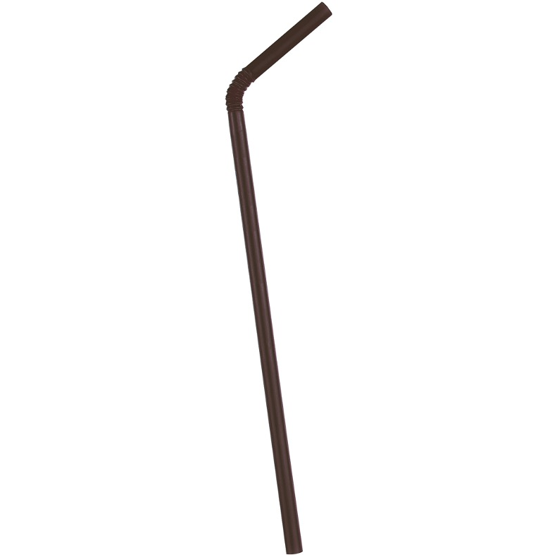

# Special categories and examples

# Table of Contents
- [9-Carton drink](#waste7)
- [10-FF cups](#waste8)
- [16-Glass splinter](#waste13)
- [17-Syringes](#waste14)
- [26-FF cups (only lid)](#waste22)
- [27-FF cups (only straw)](#waste23)
- [28-FF fries box](#waste24)
- [30-FF burger/nuggets box](#waste26)
- [31-FF paper folder](#waste27)
- [32-FF other box (Happy Meal...)](#waste28)
- [33-Iqos](#waste29)
- [34-Confettis](#waste30)
- [35-Medium big stain](#waste31)
- [36-Transparent plastic](#waste32)
- [37-Opaque plastic](#waste33)
- [38-Fabric](#waste34)
- [39-Capsules (from bottle or can)](#waste35)
- [41-Carcass](#waste36)
- [61-Robidog](#waste42)
- [63-Masks](#waste45)
- [80-Nitrous oxyde bottle](#waste46)
- [81-Transp. plastic food tray](#waste48)
- [82-Opaque plastic food tray](#waste49)
- [83-Cardboard food tray](#waste50)
- [84-Transp. plastic tray lid](#waste51)
- [85-Transparent cup](#waste52)
- [80-Nitrous oxyde bottle](#waste46)
- [92-Big nitrous oxyde bottle](#waste53)

## All categories with images

### Quick view - confusing categories
This table shows several examples for categories that might be mistaken with others. This is not an exhaustive list.
You will find each category with description and other examples below.

### 9 - Carton drink 

They are rectangular carton drink cups (small carton drink boxes with a little straw), or carton (for example carton of milk) or juice.

### 10 - FF cups drink receptacles 

Plastic or cardboard fast food cups, for example Mc Donald's or Starbucks cups, ice cream cups and any other cardboard or opaque plastic cup. Basically the only cups that should not go in FF cups are the transparent ones.
If the lid and/or the straw are on it, please tag the whole thing with this label.

### 16 - Glass splinter 

Crushed glass or broken glass. Please **both** piles of glass and isolated pieces of glass as "glass splinter".

### 17 - Syringes

### 26 - FF cups lid only 

Fast food cup - there is only the lid.
Do not tag the lid if it's on the cup: in this case tag the whole this as FF cup. Tag it only if it's completely separate.

In this case, you should tag the lid and the straw using 2 bounding boxes. Here is how to tag the **lid part** (see the straw in the category below):

### 27 - FF cups straw only 

Fast food cup - there is only the straw. Do not tag the straw if it's on the cup: in this case tag the whole this as FF cup. Tag it only if it's completely separate.

In this case, you should tag the lid and the straw using 2 bounding boxes. Here is how to tag the **straw part** (see the lid in the category above):

### 28 - FF fries box 

Fast food fries boxes (for example Mc Donald's fries boxes)

### 30 - FF burger/nuggets box 

Fast food burger of nuggets boxes

### 31 - FF paper folder 

Fast food paper folders for burgers

### 32 - FF other box (Happy Meal...) 

All the fast food boxes that do not correspond to the other categories, for example Happymeals or take-away bags.

### 33 - Iqos 

Iqos are special cigarettes that are heated by a device.

Description: iqos look like cigarettes, but completely **white**, a little bit **longer** than the cigarette butts (because they do not burn) and a bit **thiner**.

(source: https://vaping360.com/wp-content/uploads/2016/12/IQOS-33.jpg)

#### How to recognize iqos?

Here are the questions you should ask yourself when tagging iqos on images:

Here are some examples on objects that should or should not be tagged as iqos:

### 34 - Confettis 

They are small colored pieces of papers used in parties. Please tag the whole pile.

### 35 - Medium big stain 

Medium or big stain of any colour.

:warning: Do not tag water stains!

### 36 - Transparent plastic (NO CUP) 

All kind of transparent plastic: bags, glasses, boxes...
**There are separate categories for transparent cups (#52), transparent tray lids (#51) and transparent food trays (#48). Please do not tag them as transparent plastic.**

### 37 - Opaque plastic 

All kind of opaque plastics **except food trays**, which have their own category

|

### 38 - Fabric 

Can be clothes or other kind of fabric. Please do not tag masks as fabric, as we have a specific category (#45)

### 40 - Capsules (from bottles or cans) 

|

### 41 - Carcass 

Animal carcass

### 61 - Robidogs 

Robydogs are small plastic bags that contain dog droppings. They can be of several colours.

In the following images you can see those robydogs:

The robydog is only the plastic bag, not the bin! Here are some examples of robydogs on the ground:

### 63 - Masks 

Face protection masks. Most of the time, you will see blue paper mask (circled in red)

### 80 - Nitrous oxyde bottle 

Small bottles of nitrous oxyde. They are made of metal, pretty small, with a recognizable shape. The end usually appears lighter because it reflects the light.

### 81 - Transparent plastic food tray 
Transparent tray that used to contain food.
Can be round or rectangular, has to be transparent. If the lis is on, or partially placed on it, please tag the whole object as plastic food tray (do **not** tag the lid separately).

### 82 - Opaque plastic food tray 
Opaque plastic tray that used to contain food.
Can be round or rectangular, has to be opaque, will usually be black. If the lis is on, or partially placed on it, please tag the whole object as plastic food tray (do **not** tag the lid separately).

### 83 - Cardboard food tray 
Cardboard tray that used to contain food.
Can be round or rectangular, has to be made of cardboard. If the lis is on, or partially placed on it, please tag the whole object as plastic food tray (do **not** tag the lid separately).

The cardboard food trays look like the types in this image

### 84 - Transparent plastic tray lid 
Transparent plastic that goes on any kind of food trays (plastic or cardboard).
Usually you'll find them near a plastic food tray.
If it's fully or partially on the food tray (no matter which kind), do **not** tag the lid, only tag the whole object as food tray.

### 85 - Transparent cup 
Any kind of transparent cup, whether it's big small, made to contain liquid or food.
Please do not mistake them with circular food tray (which are widder and shorter).

### 92 - Big nitrous oxyde bottles 
Thesse bottles are large containers for nitrous oxyde. They might be open or closed. They look a lot like spray bottles.

