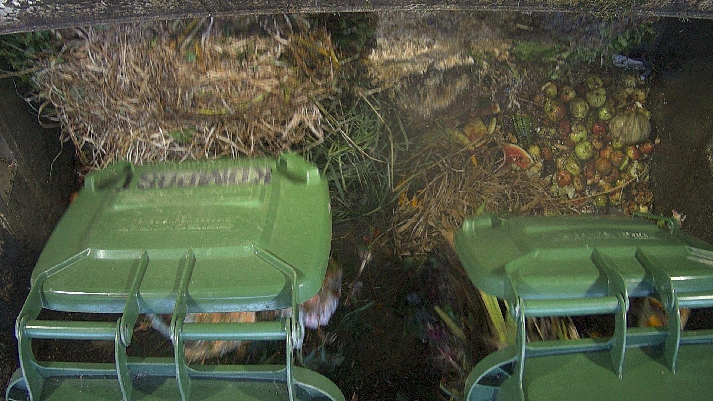
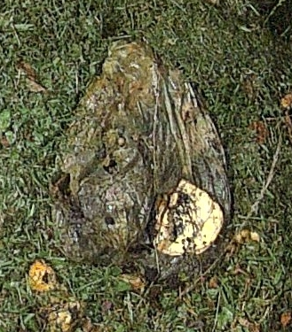
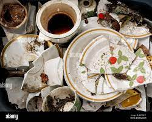

# General Biowaste

## :page_facing_up: Biowaste instructions:

###  To segment anomalies also called intruders in biowaste, please do the following: 

1. Read carefully the description of the label listed, the section how to tag and the examples bellow.

2. Carefully observe the image to find any object of the labels. Biowaste is made of strictly organic material from food rests or from the garden. Processed materials even if organic like paper or wood furniture are not included in the definition biowaste and are intruders. The images are dense and complex, containing objects with various shape and colors. Take your time to find any anomaly in the image. In this project, **everything that is not biowaste is an anomaly**.

3. You have two types of labels: some with a "category" suffix, and some without. The ones with "category" are main categories, the ones without are the subcategories we will call "types". Always try to find a specific tag corresponding to a class label. If you can't find any that fit, use one of the categories. All types belong to a category as listed below.

4. If you can clearly identify an object and there is not category for it, please propose a new category or just mark it.

5. Tag only if you are 100% sure:
    - If a doubt subsists on the type, go for a category label.
    - If a doubt subsists whether an anomaly belongs to a category or another, go for the anomaly label.
    - If a doubt subsists whether it is an anomaly don't tag it.
    
6. Look at the examples and contra example bellow.

7. Be aware of the subtitle distinction for compostable bags describe in the section how to tag.

8. Use picture classification labels for every picture.

9. Follow the decision tree pictured bellow as follows:
    - Check the general image aspect and classify if with an image label specifying the quality of the acquisition.
    - For any objects you are not certain whether it is an anomaly don't tag it.
    - If an anomaly can be identified with certainty, tag it if you are certain of the label using the following priority order: type label, a category label, the anomaly label.  

10. Follow the rules of segmentation as written in the decision tree and below in the how to tag:

## Label list

### classification labels:

**image quality**:

Each time you look at an image please select one or more labels under image quality (compulsory global classification). First choose either if the images is clean or suffer a particular degradation. in case the image is not clean, several particular cases can be selected. 

1. **clean**: The illumination is balanced without over- or underexposure, the image is crisp with good color rending, little to no blur, no large occulting object in the fields of view. 

2. **particular**: The quality of the image is affected by one or several of the following possible degradations:

    - **hard light**: Strong sun light patterns are visible giving rise to a contrasted image with sharp shadow lines. 
    - **overexposed**: The image is to bright and saturated in many places
    - **underexposed**: The image is to dark, noisy, where objects are not identifiable in many places.
    - **motion blurred object**: Falling biowaste due to motion is strongly blurred.
    - **foggy**: Hight amount of dust altering the capacity to distinguish anomalies from biowaste.
    - **dirt on lens**: Semitransparent water droplets or dirt is blurry the image.  
    - **occulted**: Strongly altered optical access due to occulting object in the field of view

        
        
    - **abnormal**: Anything looking wrong which does impact significantly the observation compared to the usual scene such as a wrong orientation of the camera or wrong waste flux like cardboard instead of biowaste.

Example of a clean image without particular degradation.

### segmentation labels:

The “Type” labels to classify anomalies are organized under the “Category” labels as follow: “Category” labels contain several sub-labels: the “Type” labels. The “Type” labels have no sub-label. We don't use any dependency such as parent-child systems on the tagging platform. We rather indicate in the label name if it is a category using the suffix of the same name. “Type” label names do not contain either the suffix category or type.

**note:** The example images are generic to help picturing the main idea. It should be kept in mind that for each type of anomaly the possibilities must be broaden beyond what's on the example images. The real picture does not always provide a clear view on the anomaly, so annotate only when certain. Moreover, anomaly objects might be damaged, crumpled, or broken pieces of the original object. When available and useful some real pictures from our application field are presented. Keep also in mind that anomalies tend to be object providing from the kitchen or the work in garden. Example images below are oriented in this sense.

1. **hard light category**: Under direct sun illumination the scene is highly contrasted because there are dark shadows lying between or on side of projected hard light in the field of view. Label only the highly illuminated regions where the sun light falls on the observable surface. The hard lighted regions are delimited by the darker regions (projected shadows).

     
    Exemple hard light: the illuminated region are clearly delimited and muss be segmented with labe hard light.

2. **anomaly category**: Objects which are clearly not biowaste. It can be identified as not biowaste, but the type or category cannot be identified with certainty or it does not belong to one of the category labels. In the last case please signal it and propose a new category label (see decision tree below).

3. **magnetic category**: Iron items. Aspect can be metallic, painted or coated with paper or plastic.
    - **tin can**: tinned iron food conserves.

         
    - **metal wire**: magnetic metallic wire unrolled or used to attach garten biowaste together.

         
    - **metal wire grid**: Like used for fence.
    
         
    - **metal beer lid**: Crown shaped lid used to seal beer bottle but which can be 

         
    - **tool with metal**: All tools like those use in garten which contain iron. Cutting tools, hammer, etc...

         
    - **metal fastener**: Metallic Screw, bolds, nuts, nails, plates, metallic parts, workpiece, etc...

         
4. **aluminum category**

    
    
    <em> Aluminum types: can (top), foil (bottom right) and packaging (bottom left and middle) </em>

    - **aluminum can**: Round shaped drink and aerosol container made of aluminium
    - **aluminum foil**: Thin aluminum foil that can be crumpled or crushed.

        

        <em> Exemple of a crumpled aluminum foil</em>
    - **aluminum food packaging**: Use as food box in take away restaurant. Made of thicker aluminum foil. Different shape and size.

5. **thick plastic category**

    - **plastic bottle**: All plastic recipients that contain liquids, like PET bottles but also shampoo, deodorants, soap, detergent, etc... They can have a spray nozzle on top or be made of white plastic like bottles used for milk or cleaning products. Bottles can be transparent, opaque, colored, black or white.

        
    - **plastic lid**: All plastic lids with different shape that can be screwed on bottles and tubes. 

        
    - **plastic flower pot**: Can be of different colors and shape.

        
    - **plastic packaging**: All plastics thicker than foils used for example to package food but also other items. They are usually looking like boxes and recipients. The color size, and shape vary. It might be transparent or opaque even completely black.

        
        
        

        <em> Spay, deodorant and shampoo bottles belong to the type "platic bottle" the rest is plastic packaging.</em>
    - **cloth**: Trousers, shirts, cap, hat, gloves and all other clothes made of fabric. No distinction between cotton and synthetic. 

        
        
        

    - **shoe**: Shoes and boots and all other footwear. 

        
    - **fabric**: All fabric other than a complete piece of cloth. All tissue, wipe, mesh, net, etc. If it's clearly made of paper, then use a type under the paper category.

        
    - **string, strap, rope**: String, rope or a strap can be seen loose or binding a bunch of biowaste like branches or straw together.

        
        
        
    - **hygienic mask**: All face masks against virus, dust, or other airborne chemicals. 

        

6. **plastic foil category**
    - **plastic bag filled with biowaste**: Transparent to semitransparent plastic bags where it is reasonable to think there are filled with compost. If the bag looks empty please use the plastic foil category.

        
        
    - **plastic foil, empty bag**: Empty plastic bags to carry the shopping or food packing bags, stretch foils, etc...

        
        
    - **sticker label, etiquette**: Label might be sticked or just attached to fruits and vegetable. They might also be used to identify plants when sticked in the earth of flowerpots. The label might be also loos, detached from their original item.

        
        
        
    - **laminated paper**: It differentiates from news paper and cardboard by its shiny aspect meaning it as be laminates. Laminated prints have a platic foil as protection coating. Magazine, journal, pictures, menues and so on can be laminated. 

        
        
        
        
        
        
        
        

7. **compostable bag category**: Bags with a grid pattern. Soft and light colors, transparent or semitransparent (milk). The grid might be continuous or is made of small written characters. The grid might be white, colored, or dark and is contrastable with the background. Within the grid cell there might be a logo following thus the pattern. 

    
    
    
    
    
8. **ceramic category**: Anomaly made of ceramic. In many cases only broken pieces are visible. If the shards are ceramic for sure but are to mush broken to identify the type, please label with ceramic category.
    - **ceramic flower pot**: Pot for plants used in or outdoors. Usually round and V-shaped.

        
        
    - **ceramic dish**:

        
    - **ceramic pottery**: Kitchen utensil, decorations, jarre pot and recipient made of ceramic. Ceramic parts that are more exotic like parts of electronic or toys goes the ceramic category.

        
        
        
        

9. **glass category**: Entire or broken pieces made of glass. Glass shards providing from unidentifiable glass object. Glass can be transparent, opaque and collored.

    

    - **glass bottle**: Any entire bottle made of glass fully or partially visible or glass shards recognizable as providing from a glass bottle. Bottles are made to contain liquids.
        
        
        
    - **glass recipient**: Shaped glass mostly recipients which are not a bottle.
        
        
        
        
    - **glass sheet**: Flat glass, window glass, entire or broken.

        

10. **composite category**:
    - **coffee capsule**: Aluminum, plastic, composite coffee capsules for coffee machines. 

        
    - **tetra pak**: Drink recipient made of composite layered walls.

        
    - **cigrarette iqos**: Cigarettes buts, iqos from electronic smoking.

        
    - **electric cable**:

        

11. **paper category**:
    - **paper bag, sheet**: Carry / shopping bags made of paper. Sheet of paper other than newspaper, magazine, or books. Paper used to wrap food like sandwiches. 

        
        
    - **newspaper**:

        
    - **paper food packaging**: Cardboard like shaped paper like boxes, egg holder usually used to hold food.

        
        
    - **paper cardboard**:
        
        

12. **strap category**: When you are not certain whether an intruder like a string, strap, rope or wire is metallic or not, then label it strap category.

13. **food packing category**: When you are not certain whether food packing is paper only or laminated or plastic, the label it as food packing category.

14. **wrapping category**: When you are not certain whether a foil wrapped, crushed is made of plastic. paper or aluminum.

15. **alarm category**: bulky goods that can't be well quantified.
    - **big stone**: Rocks, bricks, etc...
    - **bulky good**: Furniture.
    - **electronics**: Computer, smart phone, toaster, mixer, speaker, etc...
    - **filled bag unkown content**: The bag is filled:

16. **occulting category**: do not belong to the load but is visible on the picture in front of the biowaste (no as background)
    - humans: people might enter the truck and are visible on the images

         
    - waste container: Container when pouring biowaste into the truck might be visible on the picture.

        
    - other occulting objects: Anything like curtains, ropes, cable that do not belong to waste but are in front of it. 

## How to tag
### Parts
In the context of Biowaste, it may be hard to determine the contour of an object and if multiple instances belong to the same object. For that reason, most of it is up to interpretation when not obvious and several annotations might be valid.

For example, both segmenting the next image as 1 or 2 object can be considered valid as it is not clear if they are indeed part of the same object or two separate entities.

In the case of a partially obstructed object (branch laying across the object) where it is obvious that the showing parts belong to the same object, one can decide to segment the object in several parts, then attributing them to the same object by linking all the parts with the “relationship“ tool. 

### Rules of segmentation:
- Segment around big and clear objects which are in front of the intruders.
- Link all parts of one object to one reference part like shown below.
- Do not segment around masking small objects for which the occulting surface is not proportionally relevant to the entire anomaly. 
- Do not segment around complex objects like semi-transparent textures or sparse dirt when the shape of the intruder can be guessed.

 

### Relationship tool
1. To use the relationship tool, first segment your object’s parts

2. Select the “relationship” category on the category list. 

3. Select one part of your object by clicking on one of the showing dot. Drag the arrow to another part of the object and select one of the showing dot. 

Note: for best practice,  one should choose a part as target and link all other object’s parts to that one (see example below).

 

### Special attention for compostable bags 
Specification on compostable bags: 

Compostable bags are hard to distinguish from regular plastic bags. Their main difference is that they tend to have a grid-like pattern. While their color might change, they are mostly white or green.

Here are some example: 

## Decision tree

## More exemples and contra exemples

On this example there are two types of candidate anomalies: 1) The white and egg like shaped object and, 2) The grey surface partially occulted in the background.

N°1: Might be crumpled paper, eggs, mushrooms, plastic balls, etc... Since we can't be sure it's an anomaly else than biowaste, we can't tag it.

N°2: The grey surface can be anything and thus might be biowaste too. So, we don't tag it either.

That plant was before in a flowerpot. The shape of the pot is clearly recognizable. However, there is no plastic bag wrapping it neither the pot is present anymore. Nothing to tag on this example.

Original: 

zoom1:
On the very bottom of the image, it one distinguishes an anomaly with certainty. As this anomaly is not classifiable one just tags as anomaly. 

zoom2:
The pink napkin can reasonably be classified as "paper bag and sheet". Below it there is an anomaly that look like wrapped paper, but it could be plastic too. Thus, we classify it as wrapping category.

