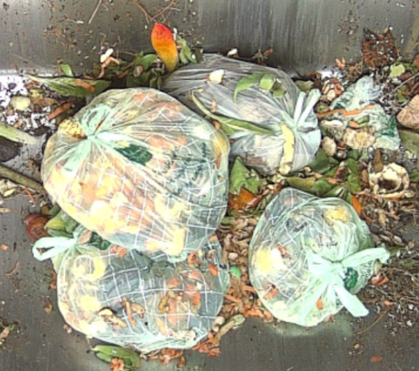

# General Biowaste

## :page_facing_up: Biowaste instructions:

1. Observe carefully the image to find any object of the categories. There are a lot of things in those images so take your time to find any anomaly in the image. In this project, **everyting that is not compost is an anomaly**.

2. When a whole object is split in two or more parts because there's another object in front of it masking part of it, please draw both parts separately and then use the "same object" relation to indicate that both parts go together. See below how to use this tool in case there are more than 2 parts.

3. Skip all the images that have no anomalies.

## How to tag
### Parts
In the context of Biowaste, it may be hard to determine the contour of an object and if multiple instances belongs to the same object. For that reason, most of it is up to interpretation when not obvious and several annotation might be valid.

For example, both segmenting the next image as 1 or 2 object can be considered valid as it is not clear if thy are indeed part of the same object or two separate entities.

In the case of a partially obstructed object (branch laying across the object) where it is obvious that the showing parts belong to the same object, one can decide to segment the object in several parts, then attributing them to the same object by linking all the parts with the “relationship“ tool. 

An object should be segmented in parts when the surface covered is proportionally relevant (see example below). Again, this is up to interpretation.

 

### Relationship tool
1. To use the relationship tool, first segment your object’s parts

2. Select the “relationship” category on the category list. 

3. Select one part of your object by clicking on one of the showing dot. Drag the arrow to another part of the object and select one of the the showing dot. 

Note : for best practice,  one should choose a part as target and link all other object’s parts to that one (see example below).

 

 
Specification on compostable bags : 

Compostable bags are hard to distinguish from regular plastic bags. Their main difference is that they tend to have a grid-like pattern. While their colour might change, they are mostly white or green.

Here are some example : 

