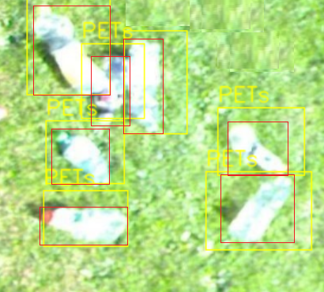
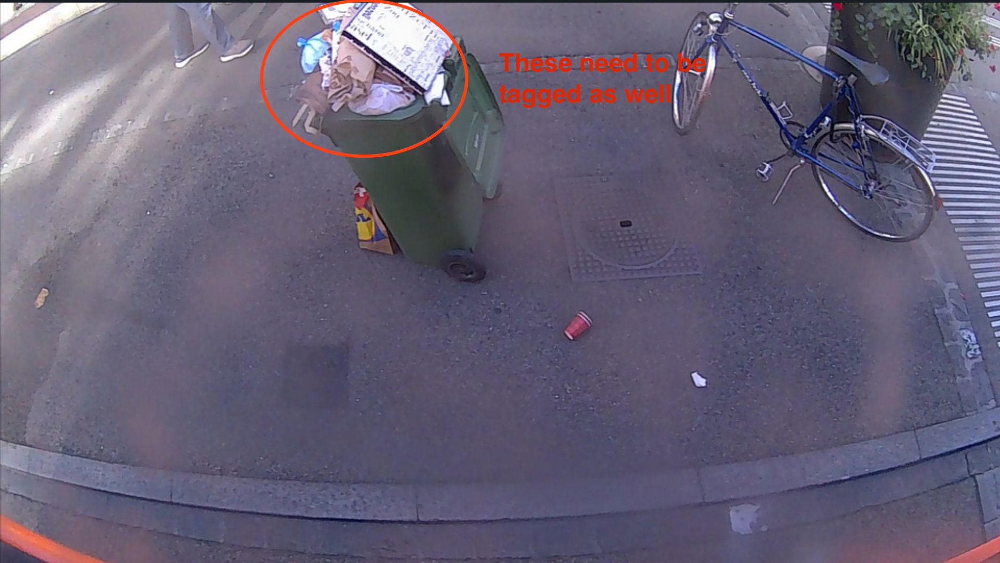

# Image Tagging for Cortexia

Here we have some information for our taggers.

## Table of Contents

- Intro
- How to tag
  - categories
  - examples
  - Useful tips
- Using the Cortexia tagging tool

## How to tag (ground rules)

The following rules should **always** be applied, even if you are provided with additional instructions.

For each identified object we need the bounding box and the class. See next section for the classification.

- **Always tag all the wastes** of the image (unless you were explicitely told to do differently)

- **Images with no wastes** can be submitted without any tags

- **If you don't know which label to use**:
  - If you have a choice between a global and a specific category, use the specific one (for example: if there is a newspaper, use the "Newspaper" category and not the "Paper/cardboard" category).
  - If you hesitate between a cigarette and a paper, choose the closest. If you can't, use "paper/cardboard".
  - If you hesitate between two other categories, choose the closest as well. If you can't, message your contact person via Upwork.
  - For any other waste, if you recognize the object but can't find the category, either search in the "Example categories" page of this documentation or message your contact person via Upwork.
  - If you don't recognize what it is but it definitly looks like littering, you can use the "Miscellaneous" category. Please use it as less as possible.

- **The bounding boxes must perfectly fit** the litter: there should not be any space between the border and the litter:

    

  In the following image, the red squares fit perfectly the PET bottles and the yellow ones are too large.

  

  

  Please use the zoom in order to draw precise bounding boxes.

- In case there are lots of wastes on the same image:
  - You need to tag each waste separately => if there are lots of papers **do not** group several of them in one single region
  - Exception: for the leaves, you have a "group of leaves" tag => use it only when you have a group of several leaves touching each other
  - Tag **all of the wastes** of the image, not some of them. If it seems an impossible job, just skip the image.

- As long as an object can be identified it should be tagged, **even if**:
  - The object is cut or partially hidden
  - The object is blurred
  - The image is upside down
  - There is poor lighting
  - The object is very small
  - The object is in a bin
    
  - The object is seen through transparent material (plastic bag, car window...)

- Bounding boxes can overlap

- **Reviewing**: images with already existing tagging information should be **checked**:
    - delete the tags and skip the image if needed (images with private info - see below)
    - check if the litter correspond to the labels, if not click on the three little dots next to the tag and choose "change class"
    - click on a tag to see which bounding box it corresponds to
    - add or delete bounding boxes if you need to (to delete: either click on the three little dots next to the tag and choose "delete" or click on the label and press the "delete" key on your keyboard)

- Group of eaves are only litter on fixed ground. on green areas they are not considered as litter.
If we have plants overgrowing the hard surface, it is the same, the green is not litter, and on top of the green everything needs to be tagged except group of leaves. 

  

- The only natural elements that we tag are the group of leaves. Do not tag flowers, grass growing on the street, branch, twigs etc. You might see some straw-shaped leaves that should not be tagged either: 

### Images that you should skip
  - images with **recognizable faces** of people
  - images with **recognizable number plates**
  - images of **private properties** (for example private garden in front of a house)
## Special instructions 

Sometimes you will be asked to focus on a specific object. In this case, you should follow the special instructions, and you should also **still follow the ground rules**.

Here are the steps to follow when you have to focus on a specific object:

## Using the Cortexia tagging tool

Please see the tool-specific information [here](tagging-tool.md)

## Using the Cortexia tagging tool as admin

Please see the admin information [here](admin.md)

## Categories

Please see examples for special categories [here](./categories_examples.md)
