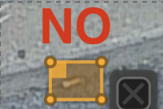
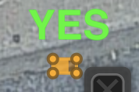
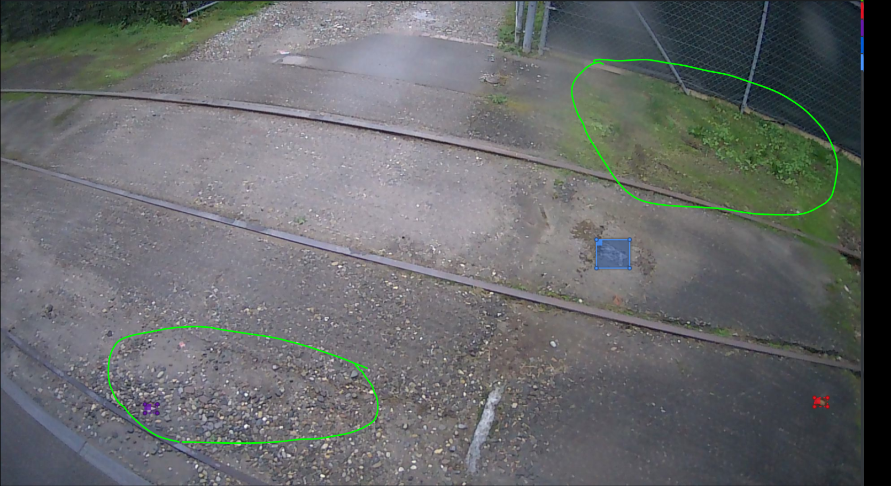
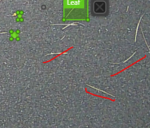
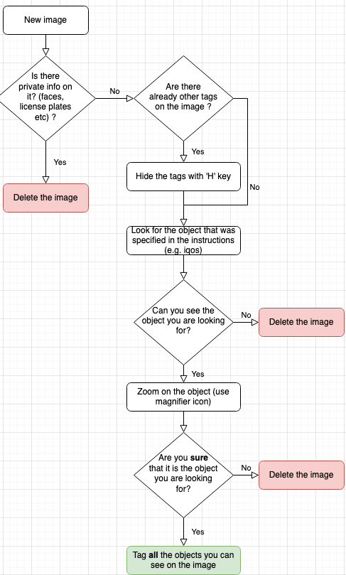

# Image Tagging for Cortexia

Here we have some information for our taggers.

## Table of Contents

- Intro
- How to tag
  - categories
  - examples
  - Useful tips
- Using the Cortexia tagging tool

## How to tag (ground rules)

The following rules should **always** be applied, even if you are provided with additional instructions.

For each identified object we need the bounding box and the class. See next section for the classification.

- You should **delete** the following images (without tagging them):
  - images with **recognizable faces** of people
  - images with **recognizable number plates**
  - images of **private properties**

- Tag a litter only if you are sure that you recognized it (no guessing). Please use the zoom to see all the details of a litter and make sure to label it correctly. You can find how to activate your zoom by clicking on the magnifier icon of the platform.

- The bounding boxes must perfectly fit the litter: there should not be any space between the border and the litter

    

  Please use the zoom in order to draw precise bounding boxes.

- In case there are lots of litters on the same image:

  - You need to tag each litter separately => if there are lots of papers **do not** group several of them in one single region
  - Exception: for the leaves, you have a "group of leaves" tag => use it only when the space between the leaves is really tiny, tag each leaf separately if possible
  - Tag **all of the litter** of the image, not some of them. If it seems impossible, just delete the image.

- boxes can overlap. As long as an object can be identified it should be tagged.

- objects can be cut off or partially hidden. E.g. hidden by image boundary, other objects, or poor lighting. As long as the visible part of the object allows to identify its classification, it should be tagged.

- The same applies to blurry parts of the image, or parts with poor lighting. 

- what is the minimum size of an object in pixel? - no fixed boundary, but many objects are small. We probably need a size of 5x5 pixel to identify the classification. As long as you can identify the litter, you should tag it.

- images with already existing tagging information should be 

  - **checked** if the tagging information is *normal*, e.g. can be selected:
    - delete the image if needed (see list of images that should be deleted above)
    - press 'h' key to hide the tags and see if the litter correspond to the labels
    - hover the bounding boxes if you don't know what label corresponds to the colour
    - change the labels if you need to
    - add or delete bounding boxes if you need to
  - **deleted** if the tagging information is inside the image itself (see image below)

  

- leaves are only litter on fixed ground. on green areas they are not considered as litter

  Leaves on green area should not be tagged:
  

  The same applies for green areas like this picture of tramways, litter needs to be tagged, except for dead leaves on the green area. 
  

  If we have plants overgrowing the hard surface, it is the same, the green is not litter, and on top of the green everything needs to be tagged except dead leaves. 
  

  On the same picture above you also see some street damage in front. The damage itself is not litter, but the loose gravel is litter and should be tagged as category 22 "Grit/Granulate/Sand"

  Do not tag this kind of items - we do not have a classification for these straw-shaped leaves: 

## Special instructions 

Sometimes you will be asked to focus on a specific object. In this case, you should follow the special instructions, and you should also **still follow the ground rules**.

Here are the steps to follow when you have to focus on a specific object:

### 

## Output format

We will need the output as JSON file if possible (unless you are using our tagging tool which will take care of this automatically). Our sample JSON format is [here](./cortexia-sample.json).

## Using the Cortexia tagging tool

Please see the tool-specific information [here](tagging-tool.md)

## Using the Cortexia tagging tool as admin

Please see the admin information [here](admin.md)

## Categories

Please see the list of categories [here](./categories.md)

Please see examples for special categories [here](./categories_examples.md)