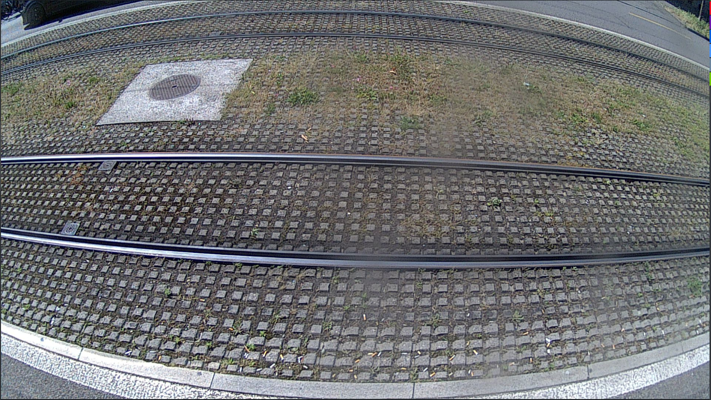

# Image Tagging for Cortexia

Here we have some information for our taggers.

## Table of Contents

- Intro
- How to tag
  - categories
  - examples
  - Useful tips
- Using the Cortexia tagging tool

## Intro

## How to tag

For each identified object we need the bounding box and the class. See next section for the classification.

- boxes can overlap. As long as an object can be identified it should be tagged.
- objects can be cut off or partially hidden. E.g. hidden by image boundary, other objects, or poor lighting. As long as the visible part of the object allows to identify its classification, it should be tagged.
- The same applies to blurry parts of the image, or parts with poor lighting. 
- what is the minimum size of an object in pixel? - no fixed boundary, but many objects are small. We probably need a size of 5x5 pixel to identify the classification
- leaves are only litter on fixed ground. on green areas they are not considered as litter, see examples below
- images with **recognizable faces** of people should be deleted 
- images with **recognizable number plates** should be deleted 
- images of **private properties** should be deleted
- If case there are lots of litters on the same image:
  - You need to tag each litter separately => if there are lots of papers **do not** add several of them in one single region
  - For the leaves, you have a "group of leaves" tag => use it only when the space between the leaves is really tiny, tag each leaf separately if possible
  - Tag **all of the litter**, not some of them. If it seems impossible, just delete the image.
- images with already existing tagging information should be 
  - **skipped** if the tagging information is *normal*, e.g. can be selected
  - **deleted** if the tagging information is inside the image itself

### Categories

Please see the list of categories [here](./categories.md)

### Examples

Leaves on green area should not be tagged:

The same applies for green areas like this picture of tramways, litter needs to be tagged, except for dead leaves on the green area. 

If we have plants overgrowing the hard surface, it is the same, the green is not litter, and on top of the green everything needs to be tagged except dead leaves. 

On the same picture above you also see some street damage in front. The damage itself is not litter, but the loose gravel is litter and should be tagged as category 22 "Grit/Granulate/Sand"

Do not tag this kind of items - we do not have a classification for these straw-shaped leaves: 

## output format

We will need the output as JSON file if possible (unless you are using our tagging tool which will take care of this automatically). Our sample JSON format is [here](./cortexia-sample.json).

## Using the Cortexia tagging tool

Please see the tool-specific information [here](tagging-tool.md)

## Using the Cortexia tagging tool as admin

Please see the admin information [here](admin.md)
