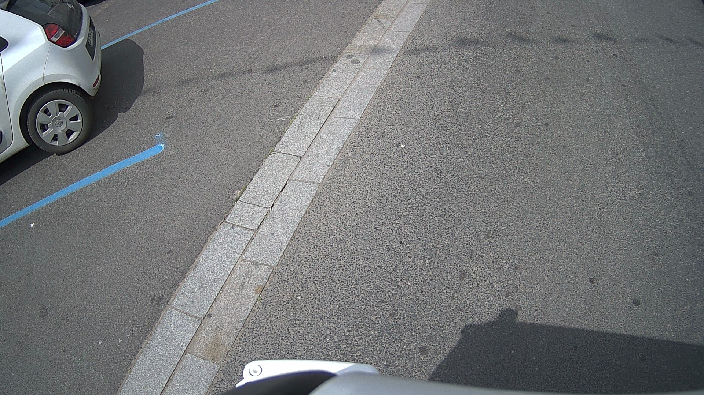
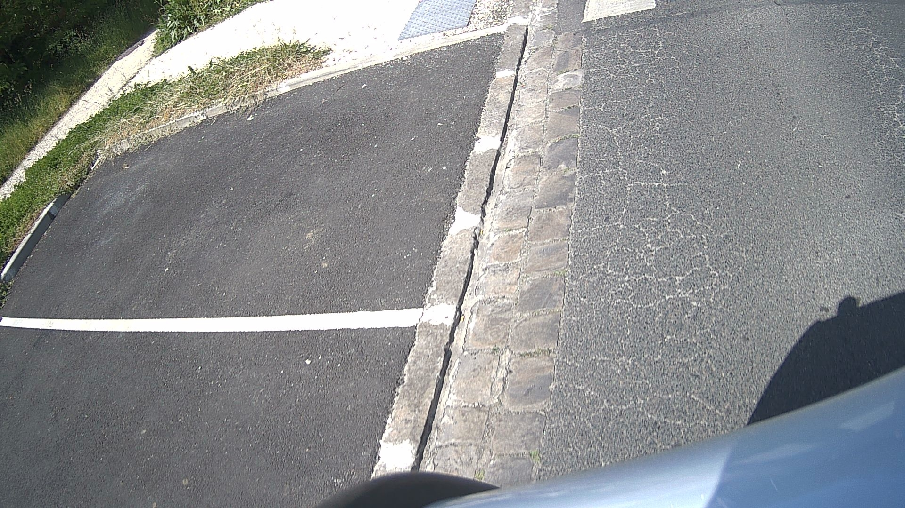
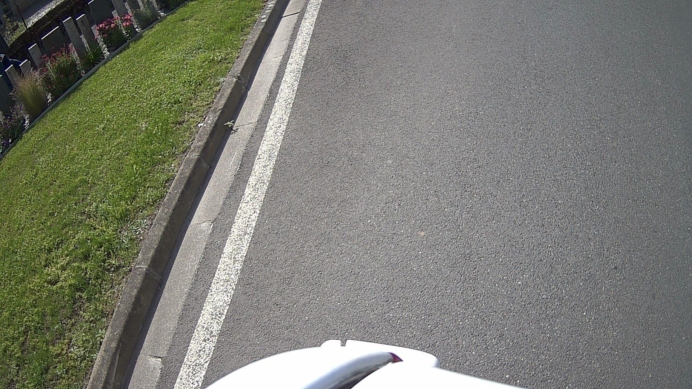
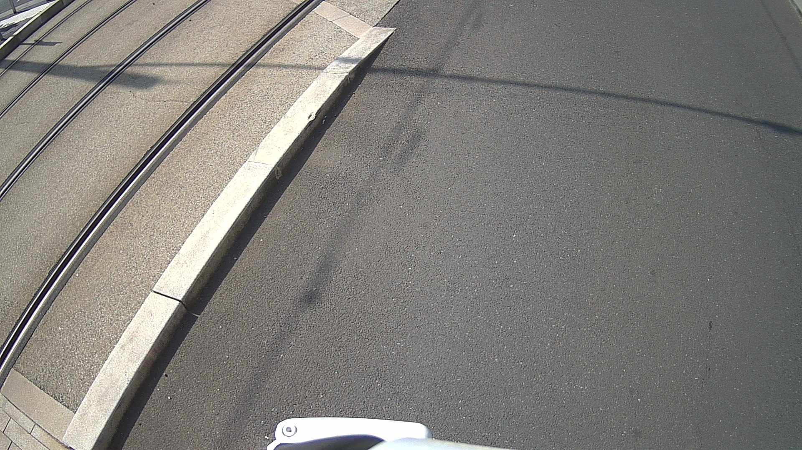
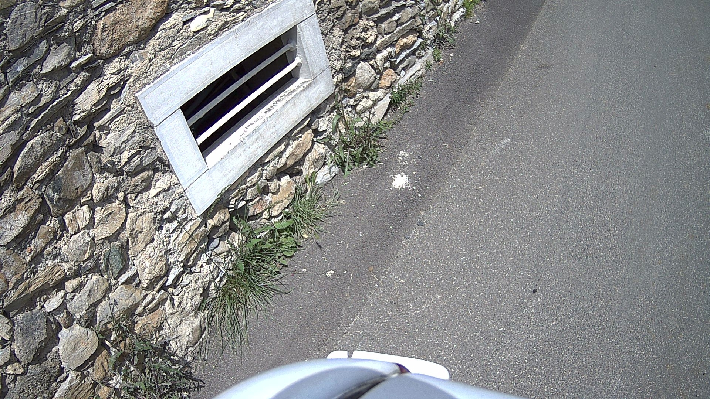
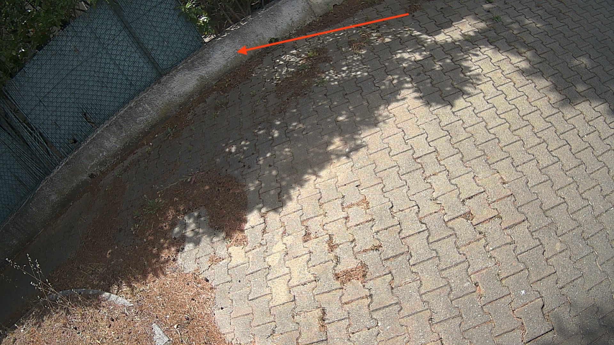
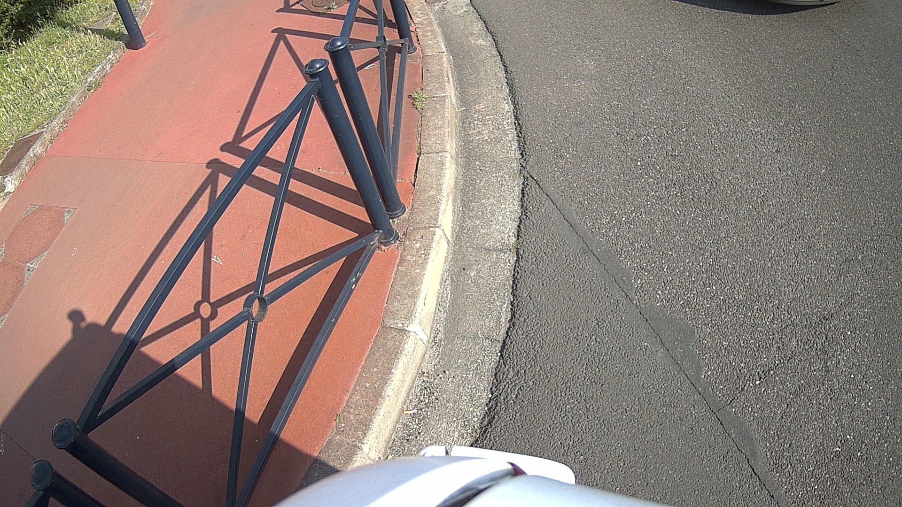
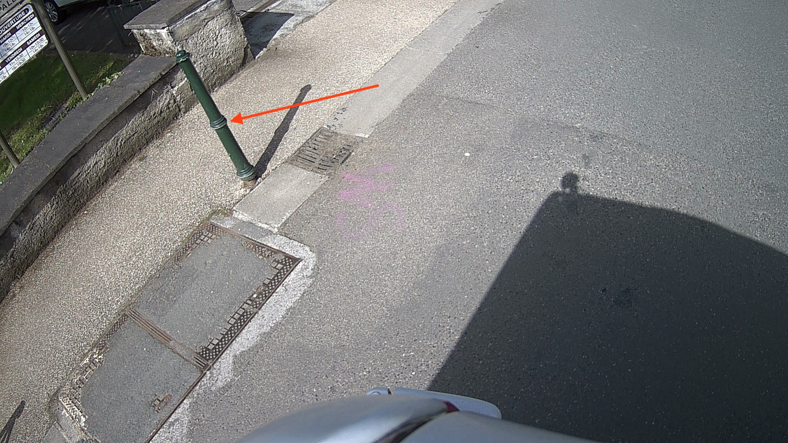
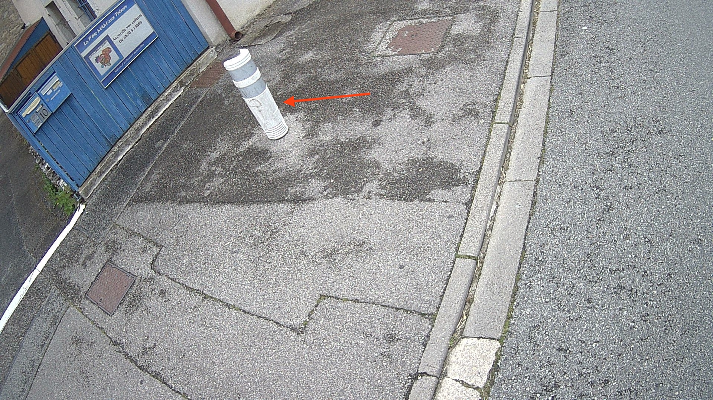

# Segmentation

You might be asked to do segmentation tagging. In this case, you will see diifferent kind of tags and use the segmentation tools. Please check the doc to see how to use the tools on LabelBox: https://cortexia-ch.github.io/labelbox-documentation/

### :page_facing_up: Segmentation instructions:

1. You should **skip** the following images (without tagging them):
   - images with recognizable faces of people
   - images with recognizable number plates
2. Please **segment the whole image** - there should be no empty parts without label
3. There should be **no space** between the shapes. Make use of the LabelBox tool advantages -> with the "add" tool, you have 2 modes:
    - one which is simple "add" (by default), if you overlap a already draw category A with a new shape of category B, the overlapping part will remain category A
    - one which is "add and replace", if you overlap a already draw category A with a new shape of category B, the overlapping part will become category B
    Please check our LabelBox doc (https://cortexia-ch.github.io/labelbox-documentation/) to learn how to use them.
4. Level of **detail**: try to be as precise as possible **but** it's okay to cut out roughly difficult shapes (for example vegetation with lots of leaves). You can rely on your own judgement to find a good balance between a good level of detail and a feasible work.
5. Object size: do not segment very small objects, like litters or small parts of grass that grow between the main road and the buildings.

### Categories descriptions
Please read very carefully and entirely!
All the images are only examples - you might see lots of different objects that fit into the category.
##### 0 – Main Road :

Part of ground on which cars usually drive, i.e. all lanes, all directions, all streets. Including the markings on the road. Areas only delimited by markings from the main road (no texture change) are also road, e.g. bicycle lanes, roundabout lanes, or parking spaces. This label does not include curbs.
##### 1 – Sidewalk:

Part of ground designated for pedestrians or cyclists. Delimited from the road by some obstacle, e.g. curbs or poles (might be small), not only by markings. Often elevated compared to the road. Often located at the sides of a road. This label includes a possibly delimiting curb, traffic islands (the walkable part), or pedestrian zones (where usually cars are not allowed to drive during day-time).

***
:warning:  **Parking are part of the Sidewalk or Main Road** class depending on their relative location: e.g. a lateral parking on the side of the road next to a Sidewalk (separated from the sidewalk by a curb) is considered part of the Main Road. On the other hand, a parking with a different texture than the Main Road, or not separated from the sidewalk (e.g. a building entrance) is labeled as sidewalk.
In the next examples, both parkings are Main Road because they are not separated from the road (the border between the road and the parking is flat and therfore not considered as curb):

 

***

##### 2 – People / Pedestrian:

People walking, standing or sitting on the ground, on a bench, on a chair (benches and chairs are Miscellaneous - please only label the humans). This class also includes toddlers, someone pushing or riding a bicycle (again - please only segment the human as the bicyle is another category). This class includes anything that is carried by the person, e.g. backpack, but not items touching the ground, e.g. trolleys. A person riding a vehicle is still considered a person and is segmented separately from the vehicle. **Exception** include rider **in closed vehicles**: if the rider is only visible through a window, the rider is considered part of the car and is tagged as such.
##### 3 – Cars:

Car, jeep, SUV, van with continuous body shape.

##### 4 – Terrain: 

Grass, all kinds of horizontal vegetation and natural terrain, soil or sand. These areas are not meant to be driven on. This label **includes a possibly delimiting curb**. Single grass stalks do not need to be annotated and get the label of the region they are growing on.
 

##### 5 – Vegetation:

Tree, hedge, all kinds of vertical vegetation. Plants attached to buildings are usually not annotated separately and labeled building as well. If growing at the side of a wall or building, marked as vegetation if it covers a substantial part of the surface (more than 20%).

##### 6 – Buildings / houses:

Building, skyscraper, house, garage, car port. If a building has a glass wall that you can see through, the wall is still building. Includes scaffolding attached to buildings.

 

##### 7 – Sky:

Open sky, without leaves of tree. Includes thin electrical wires in front of the sky.

 

##### 8 – Miscellaneous :

Things that might not be there anymore the next day/hour/minute: Movable trash bin, buggy, bag, wheelchair, animal. Any bulky item that does not belong to the other classes. Clutter in the background that is not distinguishable. Any construction zone.

 

##### 10 – Truck :

Truck, box truck, pickup truck. Including their trailers.

 

##### 11 – Bus :

Bus, long line public transport

 

##### 12 – Motorclycle :

Motorbike, moped, scooter without the driver (that's a rider, see above).

 

##### 13 – Bicycle :       

Bicycle without the driver (which goes under people/pedestrian, see above).

 

##### 14 – Rail vehicle :

Vehicle on rails, e.g. tram, train.

 

##### 15 – Rail track :

All kind of rail : subway and train and tram rail tracks

 
##### 16 – Wall :

Individual standing wall. Not part of a building.

 

 
##### 17 – Fence :
Fence including holes.

 

##### 18 – Pole :

Small mainly vertically oriented pole. E.g. sign pole, traffic light poles. If the pole has a horizontal part (often for traffic light poles) this part is also considered pole. If there are things mounted at the pole that are neither traffic light nor traffic sign (e.g. street lights) and that have a diameter (in pixels) of at most twice the diameter of the pole, then these things might also be labeled pole. If they are larger, they are labeled miscellaneous.
 

##### 19 - Water : 

Any subsential area filled with water, such as pond, watercourse, lake, etc…

##### 20 - Front of the vehicle : 

Front of the vehicle to which the camera is attached.
