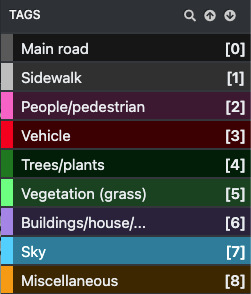
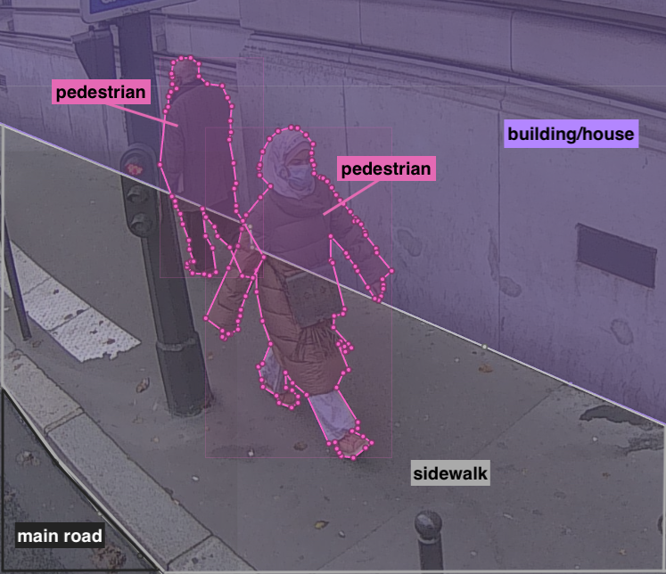

# Segmentation

You might be asked to do segmentation tagging. In this case, you will see diifferent kind of tags.

"Segmentation" means that, instead of just drawing boxes around a few objects, you will separate the image in different parts, and labelise these parts. To do so, you will use the "multipolygon" tool.

###  Multipolygon tool - how to use

1. Select the multipolygon tool in the toolbar
2. Draw your polygon point by point
3. Double click to validate your polygon

### :page_facing_up: Segmentation steps:

1. You should **delete** the following images (without tagging them):
   - images with **recognizable faces** of people
   - images with **recognizable number plates**
   - images of **private properties**
2. Identify the different parts of the images, using the list of labels
3. Start tagging with the "multipolygon" tool. Please segment the whole image, **starting by the smaller objects**. Click on top of the object boundary so that the polygon accurately delineates the object outline.
   You need to be very **precise**: the ideal outline should be good enough for somebody to recognize the object **just by seeing the drawn polygon**.
4. Label your polygon with the provided categories.

### :warning: Important remarks

- Sometimes objects will be only partially visible. This is especially true for regions like roads, buildings, etc., which become difficult to label when there are many occlusions. Please complete the boundary **as if they were not occluded**. Don't hesitate to complete the shape of the objects when possible

  - Example: there is a road that is partially masked by a tree:
    1. You tag the tree normally
    2. You tag the road as if there was no tree

  In the image below the building and the pedestrian **should overlap**:

  

  See how the shape of the people are completed:

  

- The regions can overlap

- **Do not segment litters**

- Do not segment very small objects, like small parts of grass that grow between the main road and the buildings.

- 

- You can ignore those objects: traffic signs and poles, trash bins, the visible side of the vehicle (bike or sweeper) to which is attached the camera and the camera itself.

- People on a bicycle/motorcicle should be one single object, labelled "Vehicle".

- Try to segment the whole image if you can. It is okay if there are spaces between some objects.

- Try as much as possible to label the objects in the closest provided category. If none of the categories fit the object you're seeing, use "Miscellaneous".
  Example: there is no category for the building site on the following image. You should tag it as "Miscellaneous".

  

- 

### :bulb: Help

- If you are stuck with the multipolygon tool (e.g. you can't start the polygon at the right place):
  1. Press "esc" on your keyboard
  2. Click on the mouse cursor in the toolbar
  3. Delete the point that appeared on the image
  4. Select the multipolygon tool again.

- If you cannot draw a polygon (P1) around an object because another polygon (P2) is overlapping it entirely:
  1. Slightly move P2 to the side
  2. Draw P1 around the object
  3. Move back P2 to its original place

