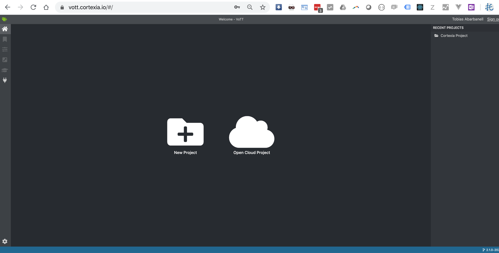
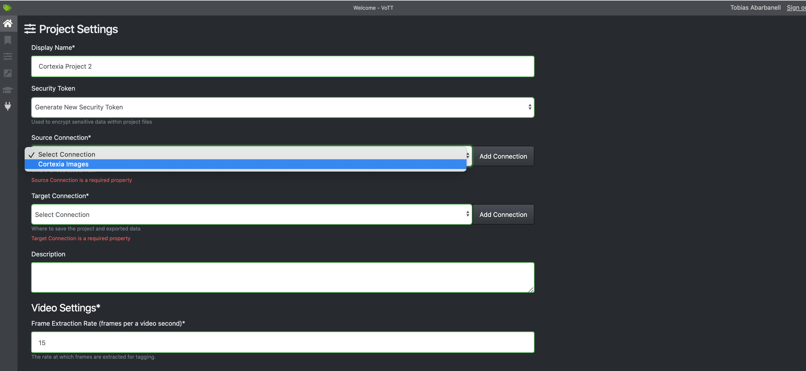
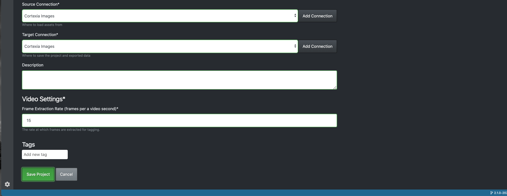
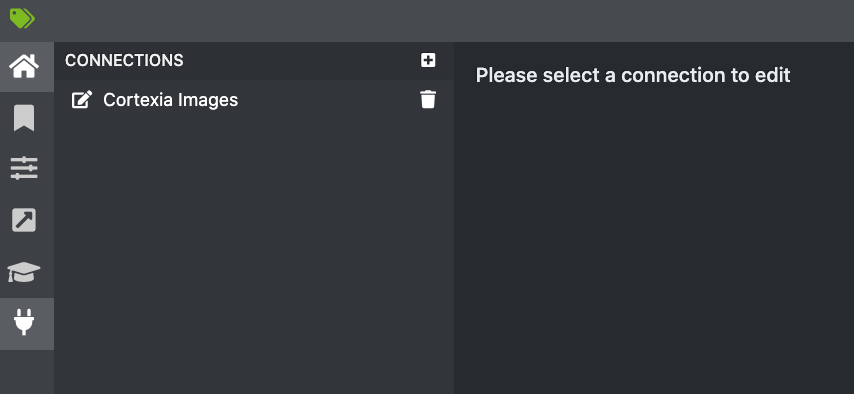

# Tagging Tool - Project setup

sometimes you will not have a project configured in the tagging tool. Here is how to set it up - you need a project and a data connection.

## create new project

click on "new project"

give it a name and select "Cortexia Images" for both source connection and target connection. (See below if the screen does not show the "Cortexia Images" connection)

Move down the screen with the TAB key until you get the save button:

Save and you will get immediately in the main screen. The images will load in a few seconds.

## create a data connection

On the left menu the lowest button is for "connections". 

Click this and you see this:

Fill out like here, using "Cortexia API"as the connection type.

