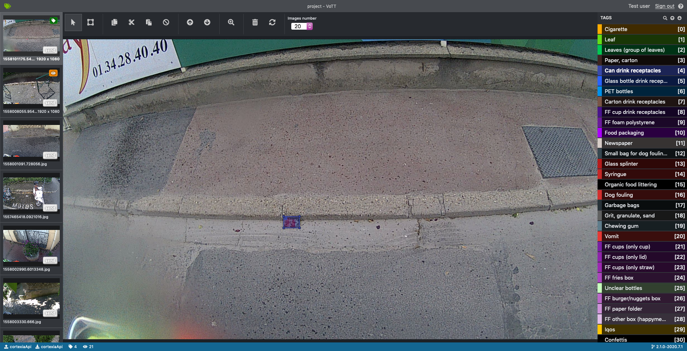
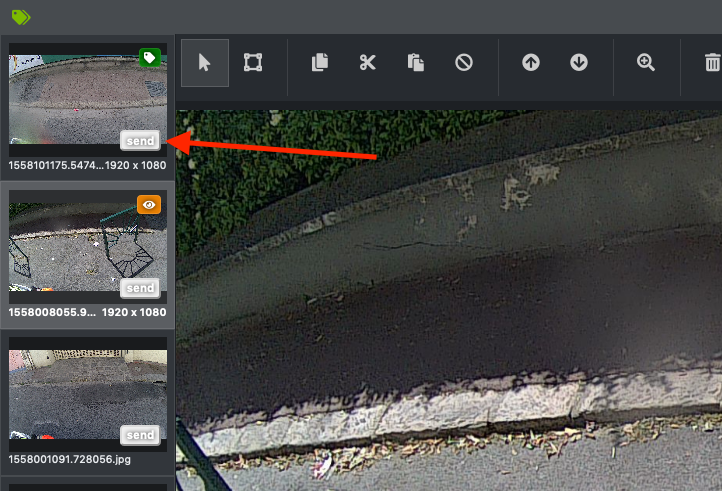
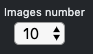

# Cortexia tagging tool

This page describes the use of the Cortexia tagging tool. The general information about tagging is [here](./index.md)

## Table of Contents

- Using the Cortexia tagging tool
  - Registration
  - Your Work Queue
  - Tagging an image
  - Saving your work
- References

## Using the Cortexia tagging tool

Cortexia has a tagging application set up where you can find 
the work queue of images to tag, and save your data right away. 

No hassle, you just need a browser and internet.

We support the following browsers: 
- Google Chrome
- Firefox

Other browsers (Safari, IE, Edge, etc.) are not supported.

## Registration

Cortexia will provide you with the credentials to get into the tagging application: 

- login (your email)
- password

To log in visit https://vott.cortexia.io/ and enter your email and password. Then wait till the images appears. It could take some time depending on your connection for the first time.

## Your Work Queue

In the application you will first find a list of images. 
Please pick one and try to identify waste (or litter) on the images. 

Typical cases would be 

- cigarettes 
- glass bottles 
- plastic bottles
- newspapers
- broken glass
- dog fouling
- leaves

The complete list of litter categories is available in the application or [here](categories.md)

## Interface

The main interface looks like the image below. You'll find:

- on the top the tools bar
- on the left you have the preview of the images with their stats (explanation below) and the button to save your work
- on the right you find the different tags (litter categories).
- In the center you have the image to tag.

## Saving your work

To save the tagged regions, you need to press the "send" button. You need to press the "send" button on **each** image in order to save them. Once the image is sent, it is definitively removed from your workspace, so you will not be able to change your tags. However, the regions will not disappear if you move from an image to another - they just won't be saved.

## Toolbar

 To create regions around litters (after creating the region choose a tag from the right by clicking on it or by using the shortcut from 0 to 9).

 To select regions and move and resize them, also possible with the upper tool.

 To copy the region, also possible with the normal keyboard short cut.

To cut the region, also possible with the normal keyboard short cut.

 To paste the region, also possible with the normal keyboard short cut.

 To remove all regions (confirmation is required).

 To have information about how to zoom available here are the links:

- Mac OS: https://www.youtube.com/watch?v=bz2JrEwvFWs&feature=youtu.be
- Windows: https://www.youtube.com/watch?v=xNhF1NJ78NE&feature=youtu.be
- Ubuntu: https://www.youtube.com/watch?v=pFwblGYjzSs&feature=youtu.be

 To delete an image

 To load new images. Should be used when you tagged all images.

 To navigate through the images. You can also use the keyboard arrows or click on the preview of the desired image.

 To choose the number of images to load when renewing the images.

### Hints

**lock**

you can lock the current litter type to tag all the same litters without selecting it every time from the right menu (tag menu).
* on windows and linux use `control` and click on the desired litter from the right menu.
* on mac and linux use `command` and click on the desired litter type from the right menu.

The next tag you will create will have the same litter type as long as you don't presse command on another litter or on the same to desactivate it.

**litter shortcuts**

When you've created a region you have to add a litter type to it. You can choose it from the right menu (tag menu). If you look closer you'll see that each litter have a number. You can type this number after creating the region to tag it with the corresponding litter. For number with 2 digits type them fast (within 0,5 seconde).

**hide**

To hide all regions (for example if you want to check what litter is hidden behind a small region), you can maintain the 'h' (for 'hide') key pressed.

## Tagging an image

Once connected and the images loaded use the regions creation tool and draw for each identified object a bounding box and the class. To add the class refer to the above regions creation tool.

- boxes can overlap. As long as an object can be identified it should be tagged.
- objects can be cut off or partially hidden. E.g. hidden by image boundary, other objects, or poor lighting. As long as the visible part of the object allows to identify its classification, it should be tagged.
- The same applies to blurry parts of the image, or parts with poor lighting. 
- what is the minimum size of an object in pixel? - no fixed boundary, but many objects are small. We probably need a size of 5x5 pixel to identify the classification
- special cases: leaves are only litter on fixed ground. on green areas they are not considered as litter:  
- sometimes you may see images with tagging information as part of the image, not editable. These images should be deleted.
- however, if the tagging information is editable, this is a validation of a previous tagging. In this case:
  - Please review them to check the tagging is complete. Add tags or remove as necessary.
  - If you save these without changes it means that you validate the work from the previous tagging run
- images with clear visible faces or car number plates should be DELETED 

## References

Our tagging platform is based on [VoTT](https://github.com/microsoft/VoTT), please refer to their documentation if you need more details.

